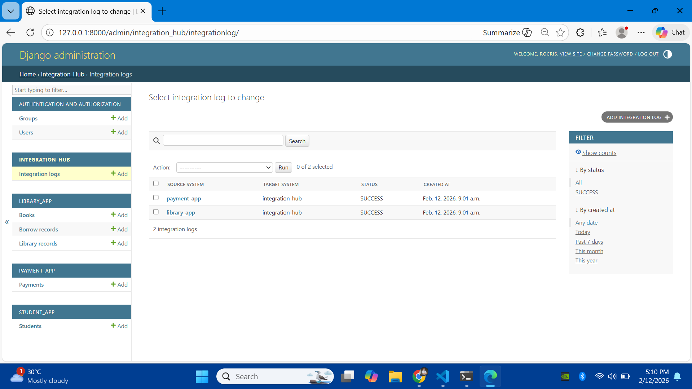
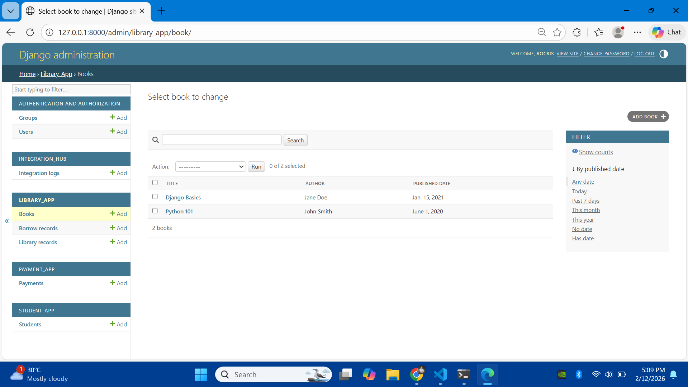
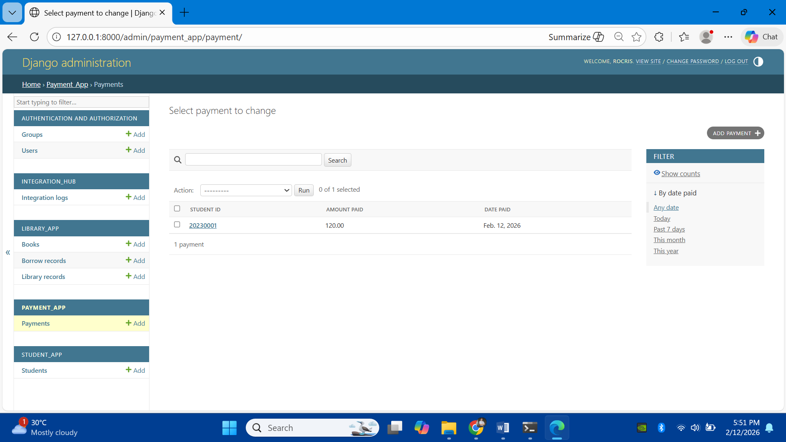

# University Integration Platform: API-Led Connectivity

## 1. Startup Narrative
The **University Integration Platform** is a centralized hub designed to simulate real-world enterprise system-to-system communication. In modern organizations, data is often siloed across different departments; this project solves that by implementing a **Hub-and-Spoke Architecture**. By connecting Student Profiles, Library Records, and Payment Services through a central Integration Hub, the system demonstrates how Django can act as a powerful middleware for data transformation and message routing.

---

## 2. System Architecture & Documentation
This documentation showcases the integration points between the various "spoke" applications and the central hub.

### A. Central Integration Hub
The "brain" of the system that routes requests and consolidates data from the Student, Library, and Payment modules.


### B. Student Management App
The primary source of truth for student profiles, providing the base identity used across all integrated services.


### C. Library & Borrowing System
Manages academic resources and checks for outstanding fines or borrowed materials before allowing further transactions.



### D. Payment Service
Records tuition payments and financial transactions, ensuring all spokes are updated with the student's current financial status.


---

## 3. Integration Patterns Applied
* **Hub-and-Spoke Architecture:** Django acts as the central middleware (Hub), connecting separate departmental apps (Spokes).
* **Request-Response Pattern:** The hub requests real-time data from each subsystem to provide a unified view.
* **Message Routing Pattern:** Logic implemented to direct API calls to the correct departmental module based on the request.
* **Data Transformation Pattern:** The system standardizes various JSON structures received from different apps into a unified response format.

---

## 4. Technical Stack
* **Framework:** Django 4.x
* **API Engine:** Django REST Framework (DRF)
* **Architecture:** API-Led Connectivity
* **Database:** SQLite3
* **Tools:** Python 3.x, Virtualenv, Git

---

## 5. How to Run the Project

### Installation & Launch
1. **Clone the repository** and open your terminal in the project folder.
2. **One-Step Initialization:** Run the following block to set up the environment, install dependencies, migrate the database, and start the server.
   ```cmd
   python -m venv venv
   .\venv\Scripts\activate
   pip install django djangorestframework
   python manage.py migrate
   python manage.py runserver
   # The Integration Hub and REST APIs will be accessible at: [http://127.0.0.1:8000](http://127.0.0.1:8000)